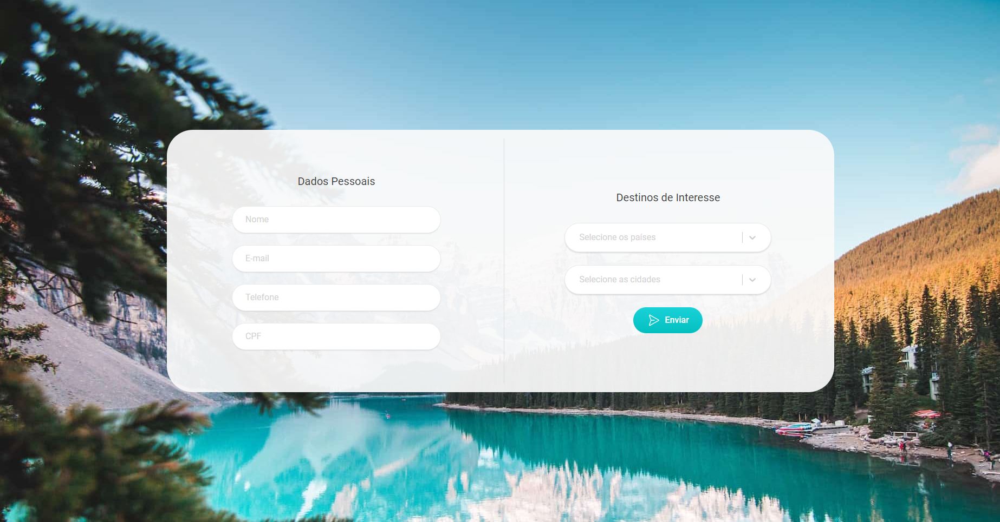

<h1 align="center"> Travelnate </h1>

<p align="center">
Challenge solved for a job selection process.
</p>


<p align="center">
  <a href="#-the-challenge">The challenge</a>&nbsp;&nbsp;&nbsp;|&nbsp;&nbsp;&nbsp;
  <a href="#-technologies">Technologies</a>&nbsp;&nbsp;&nbsp;|&nbsp;&nbsp;&nbsp;
  <a href="#-deploy">Deploy</a>&nbsp;&nbsp;&nbsp;|&nbsp;&nbsp;&nbsp;
  <a href="#-build-instructions">Build Instructions</a>
  
</p>


<p align="center">
  
</p>

<br>

<p align="center">
  
</p>

<br>

## 🏆 The challenge
The challenge was to build a React application with a form asking the user's name, e-mail, telephone number, cpf, and countries and cities of interest. All fields should be required. The countries and cities field should allow multiple selection and also make a GET from an Amazon's API.

Users should be able to:

- Fill all fields with the asked information
- View the optimal layout depending on their device's screen size
- Select countries and cities from an external info source

## 🚀 Technologies

This project was built using following technologies:

- React
- TypeScript
- JavaScript
- Tailwind CSS
- React-select
- Axios
- Radix
- Figma
- GIT
- Vite
- Node

## 🌎 Deploy
Live Site URL: [travelnate.vercel.app](https://travelnate.vercel.app/)
<br>
Figma Layout: [Figma](https://www.figma.com/file/BuionWumxGbTsuxZQVssns/travelnate) (You'll need a Figma account)

## 📝 Build Instructions
After downloading the project files run the following commands to build the project.

```
npm install
npm run dev
```
